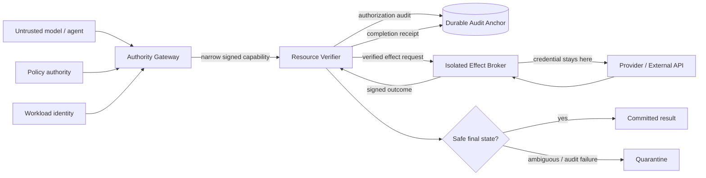

# AI Authority Kernel (AAK) v1.6.0-rc1

## 30-second overview

**AI Authority Kernel (AAK) is a security layer that sits between an AI agent and the tools or APIs it wants to use.** The model can request an action, but it cannot authorize itself.

**What I built:** deny-by-default authorization, narrowly scoped single-use capabilities, independent resource verification, replay protection, brokered credentials, mTLS service boundaries, tamper-evident audit evidence, quarantine behavior, and adversarial validation.

**Why it matters:** most agent systems focus on making models more capable. AAK focuses on limiting what happens when the model is mistaken, manipulated, or compromised.


> **A deny-by-default execution boundary for AI agents.** The model may propose an action; AAK determines whether a narrowly scoped capability exists, independently verifies it at the resource boundary, executes through an isolated broker, and commits an auditable result.

## At a glance

**Problem:** AI agents are often given broad tool or credential access and expected to behave correctly.

**AAK approach:** separate intent from authority.

```text
Model proposal
   ↓
Policy + identity + exact request verification
   ↓
Narrow single-use capability
   ↓
Independent resource verification
   ↓
Isolated effect broker
   ↓
Provider effect
   ↓
Signed / hash-linked audit evidence
```

## Architecture



The model never receives provider credentials and cannot mint its own authority. Each downstream boundary independently re-verifies the exact authorized action.

### What this repository demonstrates

- Fail-closed authorization for tool/API execution
- Single-use, replay-resistant capabilities
- Exact request/action binding
- Independent gateway, resource, broker and audit boundaries
- Brokered credentials kept outside the model and gateway
- TLS 1.3 mutual authentication and workload-identity checks
- Quarantine behavior for ambiguous provider outcomes
- Durable, tamper-evident audit continuity
- Adversarial, fuzz, concurrency and overload validation

### Verification snapshot

- **218/218 deterministic tests** passed
- **1,000,000** professional-style local attack simulations: zero unauthorized acceptances in the stated threat model
- Multiple **100,000-case** boundary campaigns: zero unauthorized effects
- **310,000** overload/failure-logic operations: zero unauthorized or duplicate effects
- **1,653** production-like HTTP requests: zero unauthorized or duplicate effects

These are local verification results for the included threat model, **not** a production certification or a claim of general AI safety.

Windows Git Bash users can start with `./setup-gitbash.sh` and verify with
`./run-tests-gitbash.sh`. See `GITBASH_SETUP.md` for the full workflow.
When working with Codex, read `CODEX.md` before making security changes.

AAK is a deny-by-default execution boundary for AI-enabled applications. The
model can propose an action, but only the kernel can authorize a narrowly
defined capability. Application code must execute the exact authorized action
and then commit an audit receipt.

This starter proves the core control flow locally. It is not a production
security certification. Production deployments must use an external secrets
manager/HSM, durable shared storage, authenticated identity, network isolation,
and independently administered policy and audit services.

Version 0.5 adds a transport-independent multi-domain reference path in
`aak/federated.py`: independent policy authorities form a threshold quorum, a
gateway issues a restricted dispatch capability, and the downstream resource
owner re-verifies the quorum, gateway signature, workload identity, exact
contract, global budgets, nonce and off-host audit continuity.

Version 0.8 hardens the interaction points between those domains. It adds
strict canonical wire schemas, sender-constrained request proofs, route/method/
audience/body binding, key validity and revocation, atomic business-transaction
idempotency, resource-version checks, integer effect units, signed downstream
receipts, locally verified audit proofs and quorum-protected policy deployment.

Version 1.0-rc3 adds provider-neutral assurance boundaries inspired by mature
authorization, workload-identity and payment systems. Signed external policy
decisions bind the exact proposal and a monotonic policy revision;
SPIFFE-shaped workload assertions bind trust domain, audience and certificate;
and a durable effect journal distinguishes prepared, submitted, succeeded,
failed and ambiguous provider outcomes. Unknown schema versions fail closed.

The included issuers are local fixtures and adapter contracts, not substitutes
for separate OPA, SPIRE, shared-database, HSM or provider deployments.

Version 1.1-rc1 introduces the Action Assurance Gateway. MCP and REST requests
are translated into one canonical `ToolCall`; a signed, versioned
`ActionEnvelope` binds the human principal, agent delegation chain, purpose,
external policy decision, exact request hash, effect limits and signed
`ToolManifest`. The resource-side verifier independently validates and
atomically consumes that authority before the tool or API executes. Protocol
adapters cannot choose a destination, resource or audience that was not
registered by trusted application code.

Version 1.2-rc1 adds the distributed staging profile: a strict HTTPS OPA
adapter, certificate-bound EdDSA OIDC workload verification, a serializable
PostgreSQL authority store, exact-origin executor egress control, and a
credential-broker interface that is reached only after authorization. A Docker
Compose topology supplies isolated PostgreSQL, OPA and identity networks. It
is a staging scaffold; the current verification did not run Docker or claim
live external-service evidence.

Version 1.3-rc1 separates the gateway, resource verifier, effect broker and
durable audit anchor into explicit service contracts. Gateway grants have a
strict canonical wire form. The resource service re-verifies and consumes the
grant, commits authorization audit before execution, applies signed-manifest
egress constraints, and asks an isolated broker to perform the effect without
exporting provider credentials. Completion-audit outages produce an explicit
committed-but-quarantined result rather than an unsafe retry.

Version 1.4-rc1 hardens the deployable service boundary. The isolated broker
independently verifies the signed envelope, manifest, exact call, audience,
expiry, action hash and destination before touching a provider. Resource,
broker and audit services use strict remote schemas over a TLS 1.3 mutual-TLS
host with exact SPIFFE URI allowlists, duplicate-key rejection, bounded bodies
and redirect denial. Manifest and envelope verifiers support overlapping key
rotation and timed revocation through `KeyRegistry`.

Version 1.5-rc1 closes three cross-service bypasses found during critical
review. The broker now requires a signed authorization-audit proof and consumes
the envelope in its own durable replay ledger before provider access. Remote
resource and broker services use process-owned clocks rather than caller-
supplied time. Signed audit-head checkpoints allow startup to reject a valid
but rolled-back audit database. The HTTPS host also bounds concurrent workers,
times out slow connections, rejects ambiguous message framing and emits
structured security outcomes.

Version 1.6-rc1 reverse-engineers the execution path from provider back to
model. Operator-owned input policies are cryptographically bound to each
manifest's schema hash and independently enforced by the gateway and broker.
Provider outcomes distinguish definitive rejection from ambiguity, and a lost
broker response is conservatively quarantined rather than retried. Provider
adapters receive the signed transaction ID for idempotency and reconciliation.
Audit receipts are anchor-domain bound, preserve historical signing key IDs and
support atomic signing-key rotation. A dedicated reverse-path attack campaign
exercises these controls.

## Security properties

- Unknown, malformed, expired, replayed, over-budget, and policy-denied actions fail closed.
- Tokens are bound to principal, action, resource, exact parameters, policy version, system version, expiry, and nonce.
- Tokens are single-use and consumed atomically.
- Authorization and execution payloads must have the same canonical hash.
- The proposing model cannot issue capabilities or modify policy.
- Execution fails closed if its start record cannot commit; a completion-audit
  outage after an external effect returns an explicit committed result and
  quarantines the agent to prevent an unsafe retry.
- Executor or audit failures quarantine the responsible agent instance.
- Only externally registered tool contracts can execute; the model cannot supply code.
- Impact is derived by trusted adapters and cannot be understated by the model.
- Audit hashes include the previous event hash and expose tampering.
- Production-oriented Ed25519 signatures separate signing from verification.
- Trusted evidence verification fails closed by default.
- Unused capabilities can be explicitly revoked.
- The credential broker independently verifies every grant before using a secret.
- Remote service endpoints require TLS 1.3 mutual authentication and exact
  operator-owned SPIFFE identity allowlists.
- Provider execution requires an audit receipt bound to the exact action and a
  second atomic single-use consumption inside the credential domain.
- Off-host signed audit checkpoints detect valid-prefix database rollback.
- Authorization time is service-owned and cannot be supplied over the wire.
- Signed schema hashes are bound to operator-owned validators at both gateway
  and broker boundaries, preventing extra-field parameter smuggling.
- Unknown provider outcomes and lost broker responses are quarantined; only an
  explicit pre-effect rejection is classified as retry-safe.
- Audit receipts bind an explicit anchor domain and retain per-event signing
  key identity across rotation.

## Verified local result

- 218/218 deterministic tests passed with `ResourceWarning` promoted to an error.
- A real loopback TLS 1.3 mutual-TLS test accepted the authorized resource
  identity and denied a different CA-signed workload identity.
- 100,000 malformed or unauthorized remote broker requests produced zero
  provider calls, zero unauthorized acceptances and zero crashes.
- 100,000 reverse-path mutations against egress, time, action hashes, audit
  events, anchor domains, signing keys and receipts produced zero provider
  calls, zero unauthorized acceptances and zero crashes.
- 100,000 distributed service-boundary mutations produced zero broker calls,
  zero unauthorized acceptances and zero crashes.
- 100,000 distributed-boundary mutations against policy, identity and egress
  adapters produced zero unauthorized acceptances and zero crashes.
- 100,000 Action Assurance Gateway mutations produced zero unauthorized
  acceptances and zero crashes; one valid control was accepted exactly once.
- 100,000 dedicated external-assurance mutations produced zero unauthorized acceptances and zero crashes.
- 1,000,000 professional-style local attack simulations completed with zero unauthorized acceptances and zero crashes.
- 100,000 compound multi-boundary attacks completed with zero unauthorized effects and zero crashes.
- 310,000 overload and failure-logic operations completed with zero unauthorized or duplicate effects and zero crashes.
- 1,653 production-like HTTP requests completed with zero unauthorized or duplicate effects and zero crashes.
- Incremental audit continuity reduced the 1,000-action benchmark from 187.2 seconds to 2.49 seconds while retaining full-history verification.
- Static security analysis reports zero findings, the locked runtime dependency audit reports no known vulnerabilities, reproducible wheels are byte-identical, and the CycloneDX 1.6 SBOM validates.
- Local mutual TLS accepted the trusted client certificate and rejected missing and untrusted certificates.

## Compound attack circuit breaker

`CompoundAttackGuard` correlates authenticated attack signals across transport,
authority, tenant, gateway, audit and downstream boundaries. Multiple distinct
boundaries increase the score faster than repeated low-severity noise. When the
threshold is reached, the external policy-enforcement point blocks that trusted
source for the configured period.

Only identity supplied by an external mutually authenticated proxy may set
`externally_authenticated=True`. Never use a subject, tenant or key identifier
copied directly from an unverified request; doing so would let an attacker frame
and quarantine another workload.
- 20,008 hostile mutations and substitutions produced zero unauthorized effects.
- One valid control action executed exactly once; replay caused zero additional effects.
- The concurrency replay test passed 200 consecutive stress repetitions.
- Independent compromise tests cover one signer, gateway, executor client,
  stolen workload identity, policy substitution and audit rollback/outage.
- Ten concurrent authorized effects preserved a monotonic audit checkpoint;
  that scenario passed 100 consecutive stress repetitions.
- 7,000 additional wire-format and sender-signature fuzz attempts failed closed.

These results apply only to the included local threat model. They are not a
claim of general AI safety or a head-to-head result against another framework.

## Run

```bash
python -m unittest discover -s tests -v
PYTHONPATH=. python tests/attack_harness.py
AAK_ACTION_GATEWAY_ATTEMPTS=100000 PYTHONPATH=. python tests/action_gateway_red_team.py
AAK_STAGING_ATTEMPTS=100000 PYTHONPATH=. python tests/staging_red_team.py
AAK_DISTRIBUTED_ATTEMPTS=100000 PYTHONPATH=. python tests/distributed_services_red_team.py
AAK_SERVICE_ATTEMPTS=100000 PYTHONPATH=. python tests/service_boundary_red_team.py
AAK_REVERSE_ATTEMPTS=100000 PYTHONPATH=. python tests/reverse_path_red_team.py
PYTHONPATH=. python examples/action_gateway.py
PYTHONPATH=. python examples/python_app.py
PYTHONPATH=. python benchmarks/microbenchmark.py
```

## Integration rule

Never give a model general shell, SQL, payment, messaging, or cloud credentials.
Expose narrow application operations and require a valid AAK capability at the
operation boundary.

For the new provider-neutral action contract and deployment boundary, see
`ACTION_ASSURANCE_ARCHITECTURE.md`.
